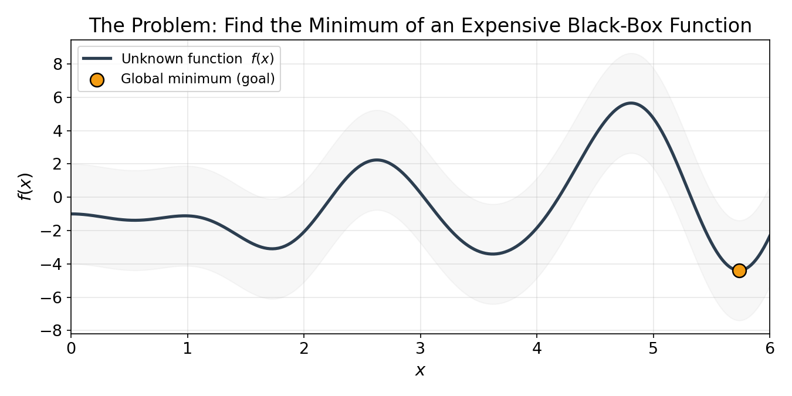
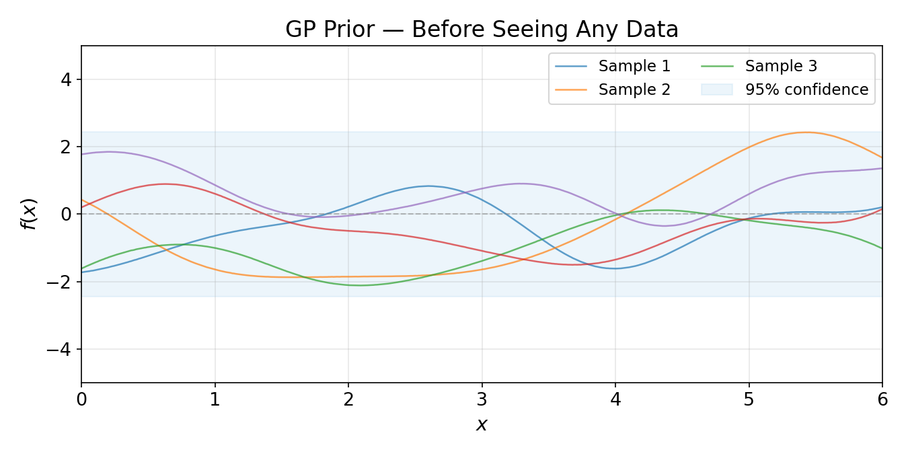
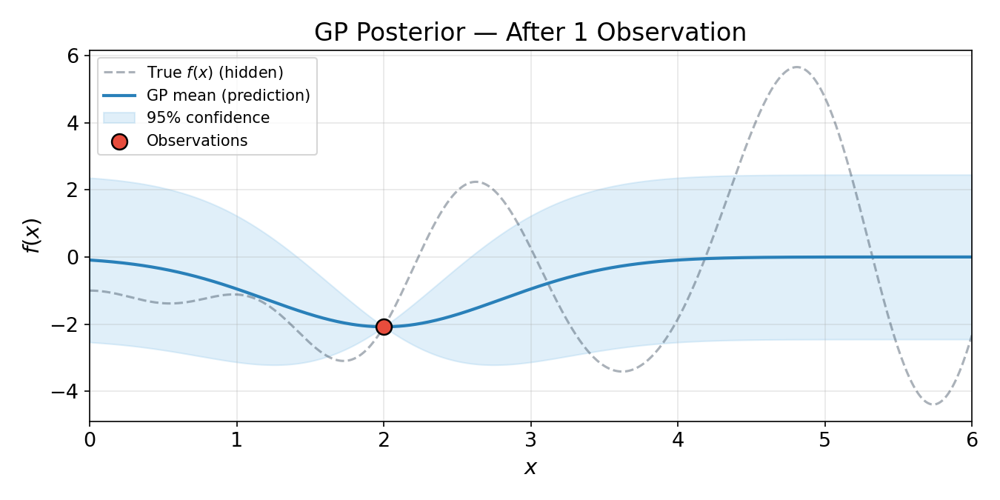
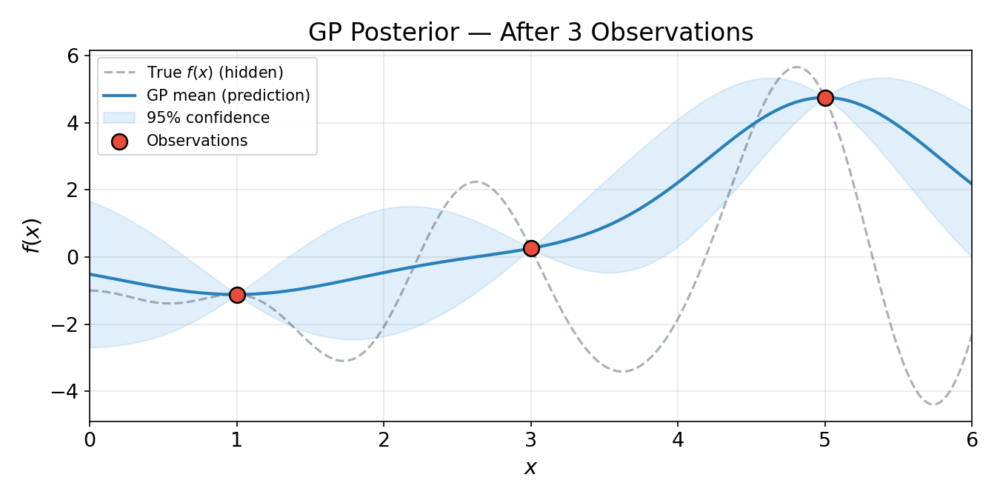
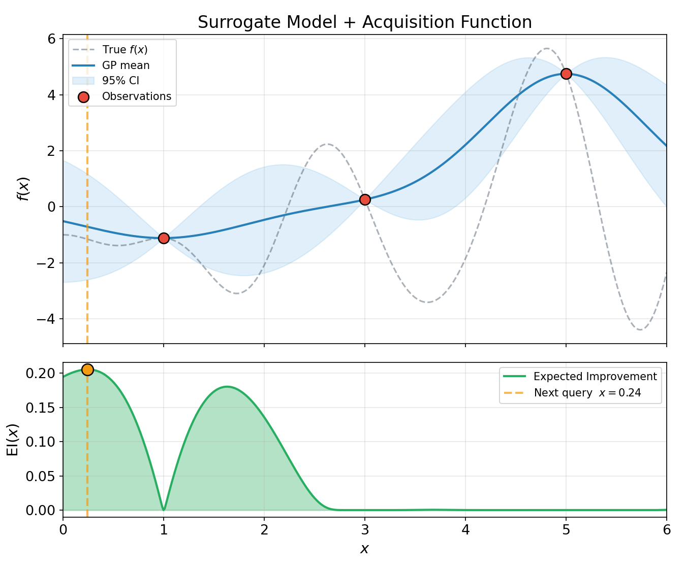
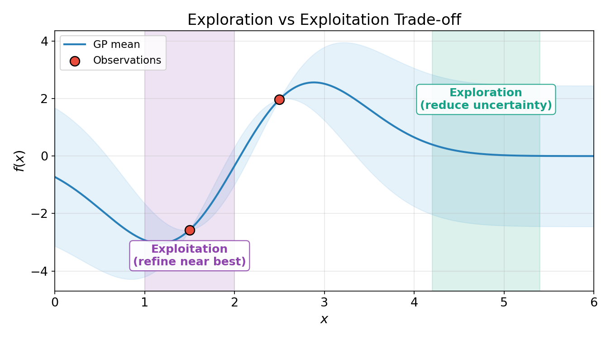
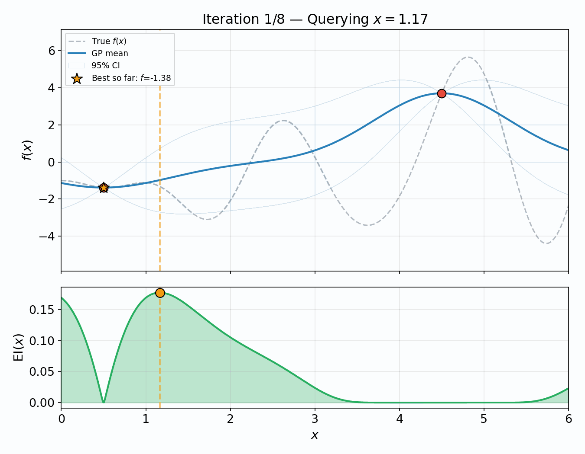
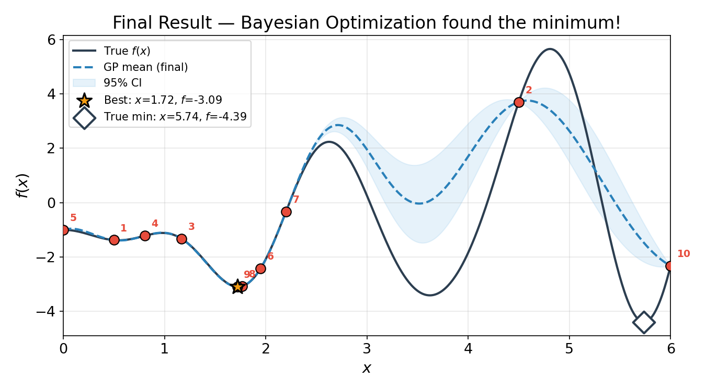

# Bayesian Optimization: A Beginner's Guide

> **Goal**: Find the best input for a function that's *expensive* to evaluate — using as few tries as possible.

---

## Table of Contents

1. [The Problem](#1-the-problem)
2. [Core Idea](#2-core-idea)
3. [Gaussian Process — Our Crystal Ball](#3-gaussian-process--our-crystal-ball)
4. [Acquisition Function — Where to Look Next](#4-acquisition-function--where-to-look-next)
5. [Exploration vs Exploitation](#5-exploration-vs-exploitation)
6. [The Full Loop](#6-the-full-loop-in-action)
7. [When to Use Bayesian Optimization](#7-when-to-use-bayesian-optimization)
8. [Summary](#8-summary)

---

## 1. The Problem

Imagine you're tuning a machine learning model. Each training run takes **hours** and costs real money. You have a knob (hyperparameter) you can adjust, but you don't have a formula for how it affects performance — you can only *try it and see*.

This is a **black-box optimization** problem:

- You don't know the function's shape
- Each evaluation is expensive (time, compute, money)
- You want to find the best setting in as few evaluations as possible



*The orange star marks the global minimum — the value we're trying to find. In practice, we can't see this curve; we can only evaluate it at specific points.*

---

## 2. Core Idea

Bayesian Optimization works in two steps, repeated in a loop:

```
 ┌──────────────────────────────────────────┐
 │  1. Build a cheap surrogate model        │
 │     of the expensive function             │
 │                                           │
 │  2. Use the surrogate to decide           │
 │     where to evaluate next                │
 │                                           │
 │  3. Evaluate the real function there      │
 │                                           │
 │  4. Update the surrogate with new data    │
 │                                           │
 │  ↻ Repeat until budget is exhausted       │
 └──────────────────────────────────────────┘
```

The **surrogate model** is typically a **Gaussian Process (GP)** — a flexible model that gives us both a prediction *and* a measure of uncertainty.

---

## 3. Gaussian Process — Our Crystal Ball

### What's a GP?

A Gaussian Process is a distribution over *functions*. Before we see any data, the GP represents our **prior belief** — essentially "any smooth function is possible."



*Each colored line is one possible function the GP thinks could be the truth. The blue band shows the 95% confidence interval — wide everywhere because we have no data yet.*

### Learning from Data

When we observe a point, the GP **updates** — the prediction passes through the observation, and uncertainty shrinks nearby.

**After 1 observation:**



*Notice how the blue band narrows near x = 2 (where we observed) but remains wide elsewhere.*

**After 3 observations:**



*More data → tighter predictions near observed points, but still uncertain in unexplored regions.*

### Key Insight

The GP gives us **two things** at every point:

| Output | What it tells us |
|--------|-----------------|
| **Mean** (blue line) | "Our best guess of f(x) here" |
| **Uncertainty** (shaded band) | "How confident we are" |

This uncertainty is what makes Bayesian Optimization *smart*. A method that only uses the mean would just exploit what it already knows. The uncertainty tells us where to **explore**.

---

## 4. Acquisition Function — Where to Look Next

We now have a cheap surrogate. But where should we evaluate the *real* function next?

The **acquisition function** answers this. It scores every possible input by combining:

- 📉 **How low** the GP predicts the value (exploitation)
- 📊 **How uncertain** we are there (exploration)

The most common choice is **Expected Improvement (EI)**:

$$
\text{EI}(x) = \mathbb{E}\left[\max(f_{\text{best}} - f(x),\ 0)\right]
$$

In plain English: *"How much better do we expect this point to be than our current best?"*



*Top: the GP surrogate with our 3 observations. Bottom: the Expected Improvement. The orange dashed line marks where EI is highest — that's where we evaluate next.*

---

## 5. Exploration vs Exploitation

The acquisition function automatically balances two competing goals:



| Strategy | Behavior | Risk |
|----------|----------|------|
| **Exploitation** | Sample near current best | Miss a better region |
| **Exploration** | Sample where uncertainty is high | Waste evaluations |

The Expected Improvement naturally balances both: it's high where the GP mean is low **and** where uncertainty is large. This balance is what makes BO so sample-efficient.

---

## 6. The Full Loop in Action

Watch Bayesian Optimization find the minimum step by step:



*Starting with 2 random points, the optimizer alternates between updating the surrogate and querying the most promising location. Notice how the confidence band shrinks as more data arrives.*

### After all iterations:



*Numbers show the evaluation order. The ★ marks the best found, the ◆ marks the true global minimum. In this run, BO found a strong local minimum — but missed the global one in the far right. This is realistic: with limited evaluations, BO can get trapped near a local optimum. More initial exploration or additional iterations would help it discover the deeper valley.*

---

## 7. When to Use Bayesian Optimization

### ✅ Great fit

- Hyperparameter tuning (ML models, simulations)
- Experimental design (lab experiments, A/B tests)
- Any setting where each evaluation is **expensive** (> minutes)
- Low-dimensional problems (typically ≤ 20 parameters)
- No gradient available (black-box)

### ❌ Not ideal

- Cheap functions (just use grid/random search)
- Very high-dimensional spaces (> 50 params) — the GP struggles
- Discrete/combinatorial spaces (without modifications)
- Functions with known analytical structure (use gradient-based methods)

---

## 8. Summary

| Concept | One-liner |
|---------|-----------|
| **Black-box optimization** | Finding the best input when you can only query, not peek inside |
| **Gaussian Process** | A surrogate model that predicts *and* quantifies uncertainty |
| **Acquisition function** | A scoring rule that balances exploration and exploitation |
| **Expected Improvement** | "How much better might this point be than my current best?" |
| **Bayesian Optimization** | Surrogate + acquisition + update loop → smart, sample-efficient search |

### The one-sentence version

> **Bayesian Optimization builds a cheap model of an expensive function, then strategically picks the next point to evaluate — balancing what it knows with what it doesn't — to find the optimum in as few tries as possible.**

---

## Generating the Figures

All figures in this document are generated by the included Python script:

```bash
pip install numpy matplotlib scipy pillow scikit-learn
python generate_figures.py
```

---

*Made with 🧪 numpy, matplotlib, and scipy.*
